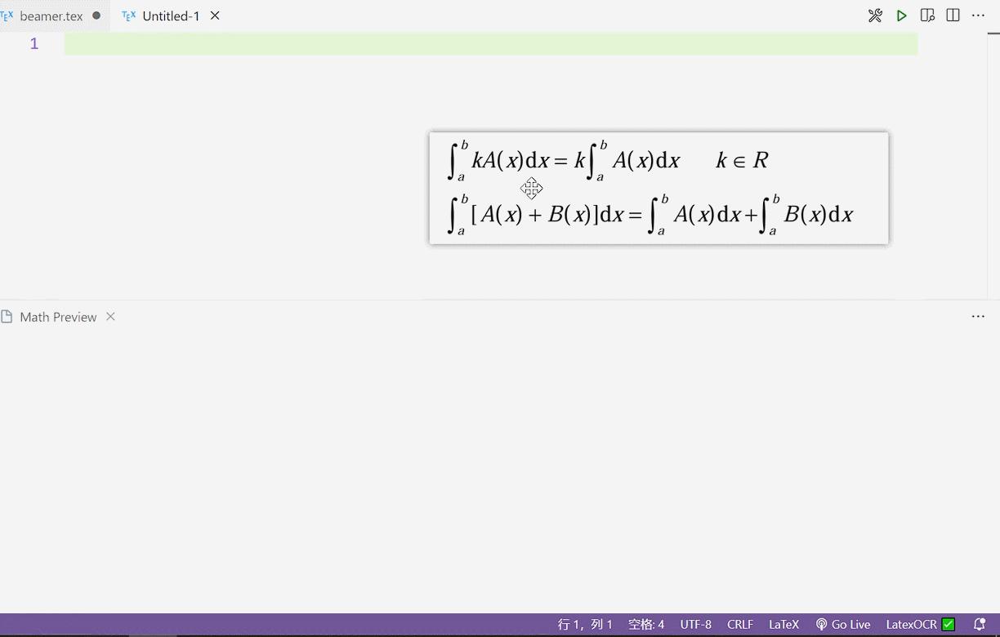

# LaTeX-Pix: Convert Screenshots to LaTeX Code

LaTeX-Pix：将公式截图转换为LaTeX代码的VSCode插件

- Fork from: [Obsidian Latex OCR Plugin](https://github.com/lucasvanmol/obsidian-latex-ocr)
- Backend: [latex-pix-backend](https://github.com/XiLaiTL/latex-pix-backend/) or [latex-ocr-server](https://github.com/lucasvanmol/latex-ocr-server)
- Model: MixTex-Latex-OCR [huggingface](https://huggingface.co/MixTex/ZhEn-Latex-OCR) [modelscope](https://modelscope.cn/models/MixTeX/MixTex-ZhEn-Latex-OCR/)

## Features 功能特性

- **Clipboard Image to LaTeX**: Directly paste a screenshot from the clipboard and convert it into LaTeX code. (Command: `latex-pix.paste-latex-from-clipboard`)
  剪贴板图像转LaTeX：直接从剪贴板粘贴截图，并将其转换为LaTeX代码。
- **File Path to LaTeX Support**: Convert LaTeX code from the location of an image file on your computer. (Command: `latex-pix.paste-latex-from-path`)
 支持文件路径转LaTeX：从计算机上的图像文件位置转换LaTeX代码。

Upon first launch, please wait for the prompt in the status bar at the bottom right corner:
初次启动请等待右下角状态栏提示:

- ✅: LatexOCR is up and accepting requests 加载完成
- 🌐: LatexOCR is downloading the model from huggingface 正在下载模型
- ⚙️: LatexOCR is loading the model 正在加载模型
- ❌: LatexOCR isn't reachable 正在启动或者启动失败

***Please note*** that the built-in environment is **Windows ONLY**. 
请注意，内置环境是**Windows** ONLY的。

If you are using another operating system, Or if you feel that the built-in model *is not powerful enough*, please configure `latex-pix.ocr.pythonPath` to the path of `python.exe` and first execute `pip install latex-ocr-server` under the corresponding path!
如果使用其他操作系统，或者觉得觉得内置的模型不够强，请配置`latex-pix.ocr.pythonPath`为`python`的路径，并首先执行对应路径下的`pip install latex-ocr-server`！

## Requirements 安装依赖

[vscode-toolbar](vscode:extension/XiLaiTL.vscode-toolbar)：Optional, support for LaTeX toolbox, which can eliminate the need to use commands. 
[工具栏](vscode:extension/XiLaiTL.vscode-toolbar)：可选，LaTeX工具箱支持，可以免去用命令的烦恼。

## Extension Settings 扩展设置

- `latex-pix.ocr.activate` :  To activate the LaTeX OCR (Optical Character Recognition) function. To enable LaTeX OCR, the corresponding model will be automatically downloaded.
  此配置项用于激活LaTeX OCR（光学字符识别）功能。要启用LaTeX OCR，会自动下载相应的模型。

  - *type*：（boolean）布尔值
  - *default*：`true`，表示默认情况下OCR功能是激活的。

- `latex-pix.ocr.delimiters`: String to put around Latex code, usually `$` or `$$` for math mode.
  此配置项用于指定LaTeX代码周围的分隔符。在LaTeX中，数学模式通常使用`$`或`$$`来标识。这个配置项允许用户自定义这些分隔符，以适应不同的排版需求。

  - *type*：（string）字符串
  - *default*：`$$`，表示默认情况下使用双美元符号作为数学模式的分隔符。

- `latex-pix.ocr.pythonPath`: Path to look for python installation or latex-pix-server installation, like `C:/Python/bin/python.exe`
  此配置项用于指定Python安装路径或*latex-pix-server*的安装路径。当指定的路径是Python安装路径时，请首先执行对应路径下的`pip install latex-ocr-server`；如果内置*latex-pix-server*的环境失效，请从https://github.com/XiLaiTL/latex-pix-backend/releases/ 下载。

  - *type*：（string）字符串
  - *default*：`python3`，表示使用内置的环境。

- `latex-pix.ocr.cacheDirPath`: Path where local model is cached, default under the plugin folder.
  此配置项用于指定本地模型的缓存路径。当*latex-pix*插件需要下载或更新OCR模型时，这些模型将被缓存到指定的路径下。

  - *type*：（string）字符串
  - *default*：空字符串（`""`），表示默认情况下模型将被缓存到插件文件夹下的某个子目录中。用户可以根据需要自定义缓存路径。

- `latex-pix.ocr.port`: Port for latex-pix-server.
  此配置项用于指定*latex-pix-server*的端口号。*latex-pix-server*是一个后台服务，用于处理OCR任务。这个配置项允许用户自定义服务器监听的端口号。

  - *type*：（string）字符串
  - *default*：`50051`，表示默认情况下服务器将监听50051端口。如果端口已被占用或用户希望使用其他端口，可以修改此配置项的值。

## Known Issues 已知问题

Cannot automatically terminate the latex-pix-server process! **It needs to be manually stopped.**
**不能自动结束掉latex-pix-server进程！** 得手动停掉。

## Release Notes

### 0.0.2

First Version.
